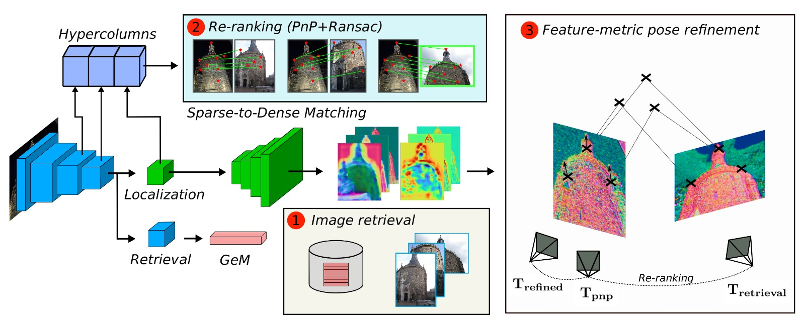

# Deep Retrieval and image Alignment Network

We introduce DRAN, a neural network able to perform all the task present in Visual Localization. DRAN solves Visual Localization in three stages, using the features from a single network:

- Image Retrieval: global descriptors are extracted by a GeM pooling stage. Map features are compared against the query descriptor with a dot product. 
- Re-ranking and initial pose: we extract hypercolumns from the encoder features, applying the [Sparse-to-Dense](https://arxiv.org/abs/1907.03965) method. This step filters the candidates and obtains an initial pose estimation for the query image.
- Camera pose refinement: we use [PixLoc](https://arxiv.org/abs/2103.09213) to align the features extracted from our trained decoder, by means of feature-metric optimization.

<p align="center">
  <a></a>
</p>

## Installation

DRAN is built with Python >=3.6 and PyTorch. To install it, run:

``` bash
git clone https://github.com/jmorlana/DRAN
cd DRAN/
pip install -e .
```

Paths are defined in [`dran/settings.py`](dran/settings.py). Folder structure is as follows:

```
.
├── datasets     # public datasets
└── outputs
    ├── training # checkpoints and training logs
    ├── hloc     # 3D models and retrieval for localization
    └── results  # outputs of the evaluation
```

## Download trained models and evaluation data

Before starting, you have to download the trained models, which can be found [here](https://drive.google.com/drive/folders/11usywhLGqJhatfSSGn1teHL16JaiMlhP?usp=sharing).

Place retrieval models (from the Google Drive link above) under `dran/retrieval/checkpoints` and localization models under `outputs/training`.

To download the evaluation data of the 3 datasets reported, run the following command:

```bash
python -m dran.download --select Aachen CMU RobotCar
```

## Usage

Despite using the same underlying network weights, retrieval and localization are implemented separately just for simplicity. Retrieval can be repoduced for the different datasets. For example, for Aachen:

```bash
cd DRAN/dran
python -m retrieval.Aachen

```

Localization results, perfoming re-ranking and pose optimization can be reproduced by calling:

```bash
cd DRAN
python -m dran.run_Aachen

```

## Training

### Data preparation

The 3D point clouds, camera poses, and intrinsic parameters are preprocessed together to allow for fast data loading during training. These files are generated using the scripts `dran/lib/preprocess_[cmu|megadepth].py`. Data can be download via:

```
python -m dran.download --select CMU MegaDepth --training
```

This also downloads the training split of the *CMU* dataset. The undistorted MegaDepth data (images) can be downloaded [from the D2-Net repository](https://github.com/mihaidusmanu/d2-net#downloading-and-preprocessing-the-megadepth-dataset). For more details about training data, please refer to PixLoc.

### Training experiment

A training experiment can be launched using the following command:

```bash
python -m dran.dran.train megadepth_test \
		--conf dran/lib/configs/dran_megadepth.yaml
```

It will initialize a frozen encoder with the retrieval weights stored in `dran/retrieval/checkpoints`, fine-tuning the localization head, the decoder and the pose optimizer.

## Implementation

This repository is a modified implementation of: [PixLoc](https://github.com/cvg/pixloc), from the paper "Back to the Feature: Learning Robust Camera Localization from Pixels to Pose" by Paul-Edouard Sarlin*, Ajaykumar Unagar*, Måns Larsson, Hugo Germain, Carl Toft, Victor Larsson, Marc Pollefeys, Vincent Lepetit, Lars Hammarstrand, Fredrik Kahl, and Torsten Sattler.

Our repository adapts some code from [S2DHM](https://github.com/germain-hug/S2DHM), [GeM](https://github.com/filipradenovic/cnnimageretrieval-pytorch) and [hloc](https://github.com/cvg/Hierarchical-Localization).

**Authors:**  [Javier Morlana](https://scholar.google.com/citations?user=1-DJMB8AAAAJ&hl=es&oi=ao) and [J.M.M. Montiel](http://webdiis.unizar.es/~josemari/).

## Related Publication:

Javier Morlana and J.M.M. Montiel, **Reuse your features: unifying retrieval and feature-metric alignment**, *ICRA 2023*. [PDF](https://arxiv.org/pdf/2204.06292.pdf)
```
@inproceedings{morlana2023reuse,
  title={Reuse your features: unifying retrieval and feature-metric alignment},
  author={Morlana, Javier and Montiel, JMM},
  booktitle={2023 IEEE International Conference on Robotics and Automation (ICRA)},
  pages={6072--6079},
  year={2023},
  organization={IEEE}
}
```


