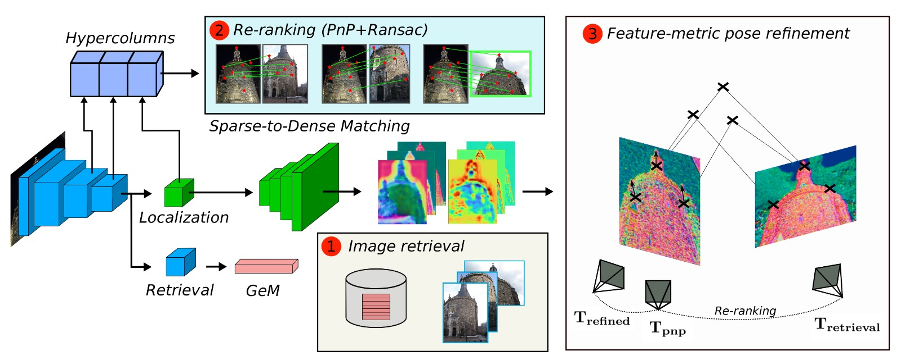

# Deep Retrieval and image Alignment Network

We introduce DRAN, a neural network able to perform all the task present in Visual Localization. DRAN solves Visual Localization in three stages, using the features from a single network:

- Image Retrieval: global descriptors are extracted by a GeM pooling stage. Map features are compared against the query descriptor with a dot product. 
- Re-ranking and initial pose: we extract hypercolumns from the encoder features, applying the [Sparse-to-Dense](https://arxiv.org/abs/1907.03965) method. This step filters the candidates and obtains an initial pose estimation for the query image.
- Camera pose refinement: we use [PixLoc](https://arxiv.org/abs/2103.09213) to align the features extracted from our trained decoder, by means of feature-metric optimization.

<p align="center">
  <a></a>
</p>

Code for training and testing should be released by the end of June 2023. 

## Related Publication:

Javier Morlana and J.M.M. Montiel, **Reuse your features: unifying retrieval and feature-metric alignment**, to appear at *ICRA 2023*. [PDF](https://arxiv.org/pdf/2204.06292.pdf)
```
@article{morlana2023reuseyourfeatures,
  title={Reuse your features: unifying retrieval and feature-metric alignment},
  author={Javier Morlana and J.M.M. Montiel},
  journal={arXiv preprint arXiv:2204.06292},
  year={2023}
}
```


